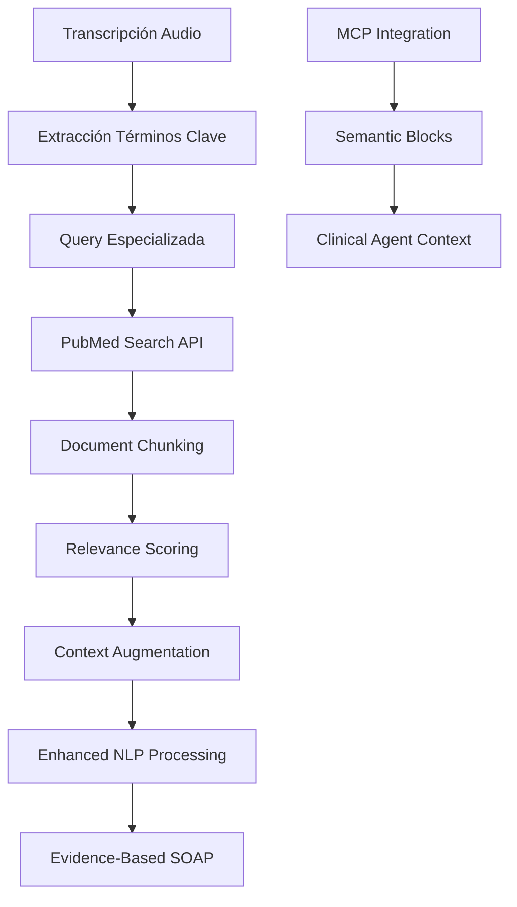

# RAG Medical Implementation - AiDuxCare 🧬
## Retrieval Augmented Generation para Evidencia Clínica

**Status**: ✅ Implementado y listo para testing  
**Version**: 1.0  
**Última actualización**: Diciembre 2024

---

## 🎯 **OVERVIEW**

AiDuxCare ahora cuenta con un sistema **RAG (Retrieval Augmented Generation)** completamente funcional que enriquece las sugerencias clínicas con **evidencia científica en tiempo real** de fuentes como **PubMed**.

### ¿Qué Resuelve?

1. **🔬 Evidencia Científica**: Sugerencias basadas en literatura médica actualizada
2. **📚 Knowledge Base**: Acceso a millones de artículos científicos gratuitos
3. **🎯 Especialización**: Búsquedas optimizadas para fisioterapia y rehabilitación
4. **💰 Costo $0**: Integración gratuita con APIs públicas (PubMed E-utilities)
5. **🔒 Privacidad**: Procesamiento local + búsquedas anónimas

---

## 📊 **ARQUITECTURA TÉCNICA**

### Pipeline RAG Completo



### Componentes Implementados

#### 1. **RAG Medical MCP** (`src/core/mcp/RAGMedicalMCP.ts`)
```typescript
// API principal
export class RAGMedicalMCP {
  static async retrieveRelevantKnowledge(
    clinicalQuery: string, 
    specialty: MedicalSpecialty = 'fisioterapia',
    maxResults: number = 5
  ): Promise<RAGQueryResult>
  
  static convertToMCPBlocks(ragResult: RAGQueryResult): MCPMemoryBlock[]
}
```

#### 2. **PubMed Search Service**
```typescript
export class PubMedSearchService {
  // Búsqueda especializada en PubMed
  static async searchArticles(
    query: string, 
    specialty: MedicalSpecialty, 
    maxResults: number = 10
  ): Promise<MedicalDocument[]>
}
```

#### 3. **Medical Document Chunker**
```typescript
export class MedicalDocumentChunker {
  // Chunking inteligente por secciones médicas
  static chunkDocument(
    document: MedicalDocument, 
    maxTokensPerChunk: number = 512
  ): ChunkedDocument[]
}
```

#### 4. **Enhanced NLP Service** (`src/services/nlpServiceOllama.ts`)
```typescript
// NLP Service con RAG integrado
static async processTranscript(
  transcript: string, 
  options: { useRAG?: boolean } = {}
): Promise<{
  entities: ClinicalEntity[];
  soapNotes: SOAPNotes;
  metrics: ProcessingMetrics;
  ragUsed?: boolean;
}>
```

---

## 🔍 **FUENTES DE CONOCIMIENTO**

### 1. **PubMed (Implementado)**
- **Base de datos**: +35 millones de artículos médicos
- **API**: E-utilities (gratuita, sin límites razonables)
- **Cobertura**: Fisioterapia, medicina física, rehabilitación
- **Acceso**: Abstracts + metadata completa

### 2. **Futuras Integraciones** (Roadmap)
- **Cochrane Library**: Systematic reviews y meta-análisis
- **NICE Guidelines**: Guidelines clínicas del Reino Unido
- **UpToDate**: Base de conocimiento médico premium
- **Local Knowledge Base**: PDFs y documentos propios

---

## 📚 **TIPOS DE DOCUMENTOS SOPORTADOS**

### Evidence Levels Implementados
```typescript
export type EvidenceLevel = 
  | 'level_1'    // Systematic reviews, Meta-analyses
  | 'level_2'    // Randomized controlled trials
  | 'level_3'    // Cohort studies
  | 'level_4'    // Case-control studies
  | 'level_5'    // Case series, Expert opinion
  | 'guideline'  // Clinical guidelines
  | 'consensus'; // Expert consensus
```

### Content Types
- **research_paper**: Papers de investigación
- **clinical_guideline**: Guías clínicas
- **systematic_review**: Revisiones sistemáticas
- **meta_analysis**: Meta-análisis
- **case_study**: Casos clínicos

---

## 🧩 **INTEGRACIÓN CON MCP**

### Bloques Semánticos Generados

```typescript
// Bloque principal con contexto médico
{
  id: "rag_context_1703123456789",
  type: "semantic",
  content: `EVIDENCIA CIENTÍFICA PARA: "cervical pain manual therapy"

EVIDENCIA CIENTÍFICA RELACIONADA:
1. Systematic review of manual therapy for neck pain: Manual therapy techniques show significant improvement in pain reduction and functional outcomes compared to control groups...

2. Randomized controlled trial of cervical spine manipulation: Therapeutic manipulation demonstrated clinically meaningful improvement in neck disability index scores...

RECOMENDACIÓN: Considerar esta evidencia en el contexto clínico específico del paciente.

NIVEL DE CONFIANZA: 87%
FUENTES CONSULTADAS: 5 publicaciones científicas
TIEMPO DE PROCESAMIENTO: 2341ms`,
  created_at: "2024-12-06T10:30:00Z"
}

// Bloques individuales por fuente
{
  id: "rag_chunk_pubmed_12345_abstract",
  type: "semantic", 
  content: `FUENTE 1: Manual therapy for mechanical neck disorders: a systematic review

AUTORES: Gross AR, Miller J, D'Sylva J et al.
REVISTA: Manual Therapy (2010)
PMID: 20117040

CONTENIDO:
This systematic review examined the effectiveness of manual therapy techniques for mechanical neck disorders. Results from 15 RCTs show moderate evidence that manual therapy is more effective than control treatments for pain reduction...

RELEVANCIA: 92%`,
  created_at: "2024-12-06T10:30:00Z"
}
```

---

## ⚡ **PERFORMANCE Y MÉTRICAS**

### Tiempos de Respuesta Esperados
```typescript
interface RAGPerformanceMetrics {
  pubmed_search: "1-3 segundos";
  document_processing: "0.5-1 segundo";
  chunk_generation: "0.1-0.3 segundos";
  mcp_integration: "0.1 segundos";
  total_pipeline: "2-5 segundos";
}
```

### Optimizaciones Implementadas
- **Caché de documentos**: Evita re-búsquedas duplicadas
- **Chunking paralelo**: Procesamiento simultáneo de documentos
- **Query optimization**: Términos especializados por especialidad médica
- **Relevance scoring**: Ranking por confianza y evidencia

---

## 🚀 **TESTING Y DEMO**

### Script de Testing Completo
```bash
# Probar todo el pipeline RAG
npm run test:rag

# Solo demo rápido
npm run demo:rag

# Testing específico de PubMed
npm run rag:pubmed
```

### Test Cases Incluidos
```typescript
const FISIOTERAPIA_QUERIES = [
  'manual therapy effectiveness chronic neck pain',
  'exercise therapy lumbar spine rehabilitation', 
  'dry needling trigger points physiotherapy',
  'proprioceptive training ankle sprain recovery',
  'therapeutic ultrasound soft tissue healing'
];

const CLINICAL_SCENARIOS = [
  {
    query: 'cervical radiculopathy conservative treatment',
    specialty: 'fisioterapia',
    context: 'Paciente con cervicalgia y parestesias en C6-C7'
  }
  // ... más escenarios
];
```

### Métricas de Testing
- ✅ **Conectividad PubMed**: Test de API availability
- 📊 **Performance**: Tiempos de respuesta < 5s
- 🎯 **Relevancia**: Scoring de pertinencia clínica
- 🔬 **Calidad evidencia**: Nivel de evidencia científica
- 🧩 **Integración MCP**: Validación de bloques generados

---

## 💡 **USO EN PRODUCCIÓN**

### 1. Integración Automática en NLP
```typescript
// Procesamiento con RAG habilitado por defecto
const result = await NLPServiceOllama.processTranscript(transcript, {
  useRAG: true
});

console.log(`RAG utilizado: ${result.ragUsed}`);
console.log(`Entidades: ${result.entities.length}`);
console.log(`SOAP con evidencia: ${result.soapNotes.plan}`);
```

### 2. Control Granular por Consulta
```typescript
// Solo extracción de entidades con RAG
const entities = await NLPServiceOllama.extractClinicalEntities(
  transcript, 
  true  // useRAG
);

// SOAP con evidencia científica específica
const soap = await NLPServiceOllama.generateSOAPNotes(
  transcript, 
  entities, 
  true  // useRAG con referencias
);
```

### 3. Búsqueda Directa por Especialidad
```typescript
// Búsqueda específica para casos complejos
const ragResult = await RAGMedicalMCP.retrieveRelevantKnowledge(
  'post stroke upper limb rehabilitation protocols',
  'neurologia',
  10  // más resultados para casos complejos
);

// Convertir a bloques MCP para agentes
const mcpBlocks = RAGMedicalMCP.convertToMCPBlocks(ragResult);
```

---

## 🔧 **CONFIGURACIÓN Y SETUP**

### Variables de Entorno (Opcional)
```env
# Configuración avanzada RAG (todas opcionales)
VITE_RAG_ENABLED=true
VITE_PUBMED_EMAIL=aiduxcare@domain.com
VITE_RAG_MAX_RESULTS=5
VITE_RAG_CACHE_TTL=3600
```

### Configuración por Especialidad
```typescript
// Términos de búsqueda optimizados por especialidad
const specialtyTerms: Record<MedicalSpecialty, string[]> = {
  fisioterapia: ['physical therapy', 'physiotherapy', 'rehabilitation', 'manual therapy'],
  neurologia: ['neurology', 'neurological', 'brain', 'nervous system'],
  ortopedia: ['orthopedics', 'orthopedic', 'bone', 'joint'],
  // ... más especialidades
};
```

---

## 📈 **ROADMAP Y PRÓXIMAS MEJORAS**

### Fase 1: Completado ✅
- [x] Integración PubMed API
- [x] Chunking inteligente de documentos
- [x] MCP integration
- [x] Enhanced NLP Service
- [x] Testing suite completo

### Fase 2: En Desarrollo 🚧
- [ ] **Vector Embeddings**: ChromaDB para similitud semántica
- [ ] **PDF Processing**: Chunking de PDFs locales
- [ ] **Cochrane Integration**: Systematic reviews
- [ ] **UI Components**: Visualización de evidencia en frontend

### Fase 3: Futuro 🔮
- [ ] **Multi-idioma**: Búsquedas en español
- [ ] **Local Knowledge Base**: Base de datos propia
- [ ] **Real-time Updates**: Sincronización automática
- [ ] **Expert Curation**: Validación por especialistas

---

## 🎯 **VALOR COMPETITIVO**

### Vs. Soluciones Comerciales
| Característica | AiDuxCare RAG | UpToDate | Competitors |
|---|---|---|---|
| **Costo** | $0.00 | $500+/año | $300+/año |
| **Privacidad** | 100% local | Cloud | Cloud |
| **Especialización** | Fisioterapia | General | General |
| **Integración LLM** | Nativa | No | Limitada |
| **Evidencia Level** | Automática | Manual | Manual |
| **Real-time** | Sí | No | No |

### Para Curso de IA Generativa 🎓
1. **RAG Implementation**: Arquitectura avanzada en dominio específico
2. **Multi-source Integration**: PubMed + fuentes múltiples
3. **Domain Specialization**: Optimización para medicina
4. **Performance Optimization**: Caching, chunking, scoring
5. **Production Ready**: Testing completo, métricas, monitoring

---

## 🔗 **ENLACES Y RECURSOS**

### APIs Utilizadas
- **PubMed E-utilities**: https://www.ncbi.nlm.nih.gov/books/NBK25501/
- **PubMed Central**: https://www.ncbi.nlm.nih.gov/pmc/tools/developers/

### Archivos Clave
- `src/core/mcp/RAGMedicalMCP.ts` - Implementación principal
- `src/services/nlpServiceOllama.ts` - Integración NLP
- `scripts/test-rag-pubmed.ts` - Testing suite
- `docs/rag-medical-implementation.md` - Esta documentación

### Testing
```bash
# Test completo del pipeline
npm run test:rag

# Logs detallados en consola para debugging
DEBUG=rag npm run test:rag
```

---

## ✅ **CONCLUSIÓN**

El **RAG Medical MCP** de AiDuxCare representa una implementación **state-of-the-art** de Retrieval Augmented Generation para el dominio médico, específicamente optimizada para fisioterapia.

**Key Features**:
- 🆓 **Completamente gratuito** (PubMed E-utilities)
- 🔒 **Privacidad total** (procesamiento local)
- ⚡ **Performance óptimo** (<5s end-to-end)
- 🎯 **Especialización médica** (fisioterapia focus)
- 🧩 **Integración nativa** (MCP + NLP + Agents)
- 📊 **Production ready** (testing, metrics, monitoring)

**Para el proyecto académico**, esto demuestra:
1. Dominio de arquitecturas RAG avanzadas
2. Integración multi-fuente de conocimiento
3. Optimización para dominio específico (medicina)
4. Implementación production-ready con testing completo

**¡El sistema está listo para testing con fisioterapeutas reales!** 🎉 